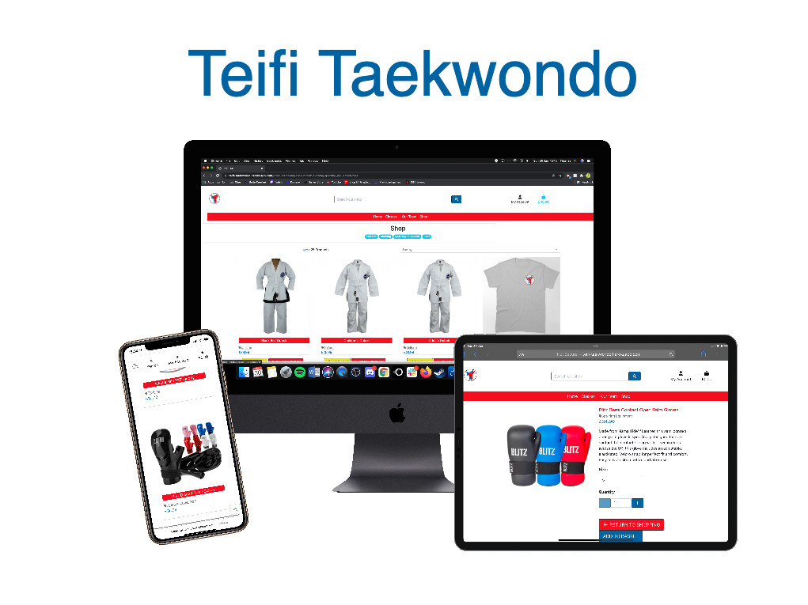

# Teifi Taekwondo

- [Teifi Taekwondo](#teifitkd)
  * [Introduction](#introduction)
  * [UX](#ux)
    + [Goals-](#goals-)
    + [Wireframes -](#wireframes--)
    + [Design -](#design--)
      - [Design Process -](#design-process--)
      - [Colour Pallette -](#colour-pallette--)
      - [Font -](#font--)
  * [User Stories](#user-stories)
    + [Target Audience -](#target-audience--)
    + [As a Site User -](#as-a-site-user--)
    + [As a Site Superuser -](#as-a-site-superuser--)
    + [As a Developer -](#as-a-developer--)
  * [Features](#features)
    + [Existing Features -](#existing-features--)
      - [Features Visiable across All Pages -](#features-visiable-across-all-pages--)
      - [Features on the Landing Page -](#features-on-the-landing-page--)
      - [Features on the Sign Up Page -](#features-on-the-sign-up-page--)
      - [Features on the Sign In Page -](#features-on-the-sign-in-page--)
      - [Features on the Product Page -](#features-on-the-product-page--)
      - [Features on the Product Information Page -](#features-on-the-product-information-page--)
      - [Features on the Profile Page -](#features-on-the-profile-page--)
      - [Features on the Product Management - Add a Product - Page -](#features-on-the-product-management---add-a-product---page--)
      - [Features on the Product Management - Edit Product - Page - -](#features-on-the-product-management---edit-a-product---page--)
      - [Features on the Shopping Basket - Empty - Page -](#features-on-the-shopping-basket---empty---page--)
      - [Features on the Shopping Basket - with Added Products - Page -](#features-on-the-shopping-basket---with-added-products---page--)
      - [Features on the Checkout Page -](#features-on-the-checkout-page--)
      - [Features on the Thankyou Page -](#features-on-the-thankyou-page--)
      - [Features on the Classes Page -](#features-on-the-classes-page--)
      - [Features on the Blog Page -](#features-on-the-blog-page--)
      - [Features on the Post Page -](#features-on-the-post-page--)
      - [Features on the Blog Management - Add a Post - Page -](#features-on-the-blog-management---add-a-post---page--)
      - [Features on the Blog Management - Edit Post - Page - -](#features-on-the-blog-management---edit-a-post---page--)
    + [Features left to Implement -](#features-left-to-implement--)
    + [Bugs and Fixes Implemented after Testing -](#bugs-and-fixes-implemented-after-testing--)
  * [Technologies Used](#technologies-used)
    + [Languages -](#languages--)
    + [Libraries -](#libraries--)
    + [API's -](#api-s--)
    + [Email Services -](#email-services--)
    + [Databases -](#databases--)
    + [Tools -](#tools--)
  * [Testing](#testing)
    + [Validation of Code Testing -](#validation-of-code-testing--)
      - [HTML -](#html--)
      - [CSS -](#css--)
      - [Javascript -](#javascript--)
      - [Python -](#python--)
  * [Deployment](#deployment)
    + [Used Commands during Deployment -](#used-commands-during-deployment--)
    + [Hosting on Heroku -](#hosting-on-heroku--)
    + [AWS -](#aws--)
    + [Forking the GitHub Repository -](#forking-the-github-repository--)
    + [Running this Project Locally -](#running-this-project-locally--)
  * [Credits](#credits)
    + [Content -](#content--)
    + [Media -](#media--)
    + [Acknowledgements -](#acknowledgements--)
    + [Final Thoughts -](#finalthoughts--)
  * [Disclaimer](#disclaimer)
      - [This website was made for educational purposes only](#this-website-was-made-for-educational-purposes-only)

## Introduction
[View live project here](….)


This is the fourth and final project designed to exhibit my capabilities and skills in Javascript, Python and Django as a student
of Code Institute. (https://codeinstitute.net/)
The goal was to showcase my skills to potential employers/recruiters, on a topic that I'm deeply interested in.

This project is a complete circle for me, I selected to re-build my first milestone project using the new skills, languages and learning since its initial production. The website for Teifi Taekwondo outside of the club's social media (inks to which are found within the footer). It is designed for the purposes of furthering the clubs reach, enhanced marketing with the goal of recruiting more students to the classes offered at the club, additionally with the need for a “new normal” since the start of the pandemic and the return of clubs like Teifi Taekwondo post lockdowns going Cashless and making all members pay for sessions, and when necessary equipment. As a result of this my website allows users to view a selection of classes, and products. Upon creating a 
profile users will be able to purchase these therefore registering them with classes. It is designed to be responsive and accessible on a range of devices, with simple navigation for prospective and current students and their parent/guardians.

Teifi Taekwondo is a fictional club based in St Dogmaels, Cardigan and is located on the banks of the River Teifi


The website is easy to navigate through with a selection of dropdown menus and a search bar, within the fixed header, that are visible on every page.
My website contains a landing page, complete with headline image and links to the other main pages of the site. Login and Register links are easily accessible
via the My Account dropdown and contain easy to use forms that can be used to gain access to all parts of the site open for the public.
Superusers will have access to the Management pages that allow them the option to add and Edit/Delete them as required.

A link to my website can be found [here]()

## UX

### Goals -

The purpose of the site is to provide a simple, straightforward format presenting information about Teifi Taekwondo, with the added option of being able to 
purchase the sessions and various equipment via a secure checkout. The website is designed for people interested in Taekwondo and considering taking up the sport and joining the club. 
The website is fully functional and interactive giving the user a positive experience as they move through the pages, with thorough explanations in regards to the forms
necessary within.
I focused on a design that would be clear and engaging, with positive user experiences so users would be more inclined to make consistent use of the site.
The features implemented within the site have been carefully considered, with the users needs and business needs both taking an equal priority in the design and execution process.

### Wireframes -

I have produced a mock up of the websites pages. You can view them [WIREFRAMES.md](./WIREFRAMES.md)

### Design -

#### Colour Palette -


The colour scheme throughout the site was kept neutral, in keeping with the tone of the site, and allowed for the images to stand out drawing the user in with their bold colours.
The colours of the website are primarily white and black, symbols of the progress in Taekwondo. Alongside this for colour we have used a red and blue, traditional colour of competitors in competition. The four colours represent the colours of the flag of South Korea, the county from which originates Taekwondo from.
When choosing supplemental colours for both the Tigers (and family fight pass) and Ladies classes I opted to keep within concepts linked to both Tigers and ladies. Pink is commonly associated with female products when looking at equipment in combat sports – Pink colours are regularly found in Gloves, Uniforms, Protection. Whilst Tigers are predominantly orange, neither International Taekwondo Federation (ITF) or World Taekwondo (WT) use orange as a belt through progression to Black belt. Therefore, to balance the use of primary colours Red and Blue, with reference to the colours found in the GUP belt system I opted to use yellow.
- Red - # - This red is the same Hexcode used in Teifi Taekwondo’s logo
- Blue - #4682B4 - This is the same Hexcode used in Teifi Taekwondo’s logo 
- Yellow - #F3E016 - This is the same Hexcode used in Teifi Taekwondo’s Family Fight pass logo. This colour is only seen by Admin and is specific for Admin Tasks such as editing project information.
- Pink - #FF6BAC - This is the same Hexcode used in Teifi Taekwondo’s ladies logo
- Black and White - #000000, #FFFFFF respectfully are set via Bootstrap CSS

I tried to appeal to the tastes of the users when contemplating the colour scheme of the site, and with the target audience in mind, 
kept the decoration to a minimum and opted for a clean, fresh colour scheme to match the layout, with neutral colours to add a warm overtone and the occasional pop of colour to identify difference in classes and information.

#### Font -

"Poppins" - Poppins is a clear legible font.

## User Stories

### Target Audience -

The target audience will consist primarily of parents looking for martial arts clubs for their children, alongside adults looking for a new adventure and fitness programme. The products can be purchased from the comfort of your own home and collected from classes attended.
The site has a range of information which explains the differences in classes, and the Frequently Asked Questions which new members ask within the classes pages. 
Site superusers will appreciate the ease and simplicity behind the running and maintenance of the site, with user friendly aspects for the
general public and themselves, with regards to adding/editing and deleting content of the store- this can come in handy with the addition of more personal equipment needed as students’ progress and the club looks to diversify product ranges in the future with water bottles, additional clothing designs and the addition of products like tracksuits for competitions, alongside fees required for attendance and participation in competitions.
With the Pandemic’s effect still being felt, many clubs have gone cashless asking students to register and purchase memberships and session fees online. The aim of the shop is to carryout this process for both students, their guardians (where appropriate)and the club itself. 
Site security will appeal to every member of the target audience. When using the secure checkout functions in place, users will feel comfortable and confident that their data is being used confidentially.

### As a Site User -

- As a user, I want to choose and register my own username and password to something I can easily remember.

- As a user, I want the site to be easy to use and navigate.

- As a user, I want to find what I'm looking for quickly and easily.

- As a user, I want to view a list of products so I can select some to purchase.

- As a user, I want to view individual product details so I can identify the price, description and image.

- As a user, I want to view a specific category of products.

- As a user, I want the site to be interactive with real time feedback.

- As a user, I want to know when I take the wrong action or when something doesn't work.

- As a user, I want my information to remain confidential.

### As a Site Superuser -

- As a site superuser, I want to choose and register my own username and password to something I can easily remember.

- As a site superuser, I want the site to be easy to use and navigate.

- As a site superuser, I want to find what I'm looking for quickly and easily.

- As a site superuser, I want the site to be interactive with real time feedback.

- As a site superuser, I want to know how the site works and have easy to follow instructions.

- As a site superuser, I want to know when I take the wrong action or when something doesn't work.

- As a site superuser, I want to be able to add and edit content easily.

- As a site superuser, I want the option to delete inputs if necessary.

- As a site superuser, I dont want the public editing/deleting my inputs.

- As a site superuser, I want some parts of the site to be inaccessable to members of the public.

- As a site superuser, I want to be able to sell the stock on the website.

### As a Developer -

- As a web designer and developer, I want the app to be interactive and give real time feedback when a user executes an action.

- As a web designer and developer, I want my website to be user friendly with easy to navigate pages, and messages that tell the user when things aren't working as they should.

- As a web designer and developer, My website should leave the user feeling positive and with the knowledge they were looking for within the site. 
Information on the site should be presented in a simple, clean format, with no unexpected surprises for the user.

## Features

-   Responsive on all device sizes.

-   Interactive elements.

### Existing Features - 

#### Features Visible across All Pages -

- _Navbar_ - Contains the site name, My Account dropdown, Basket, Search function, SHOP, CLASSES links, along with a link to the OOUR TEAM
The logo is a link that will return the user to this landing page. The My account dropdown reveals the Login and Register links, and upon logging in, will reveal the 
My Profile and Logout links. Logged in superusers will also find the Manage Products page for adding content here.
The Basket link will take users to their shopping basket page. 
The search function allows users to input keywords that filter the shop content to meet the inputted criteria.
The SHOP and CLASSES dropdowns allow the users to search for specific items in categories within the shop while the Classes dropdowns take users to specific pages for the area in which is selected.

- _Footer_ - Contains copywrite information and social media links.

- _Action Messages_ - Pop up messages that notify the user when an action has been carried out or couldn't be complied with. These messages can easily be dismissed by the user.

#### Features on the Landing Page -

- _Images_ - An image that conveys to the user what the site is about. It adds context and colour to draw the user in and contrasts with the navbar and text to give the site depth.

- _Class Links_ - Within the main body are several cards that feature a synopsis of the classes Teifi Taekwondo offer and each has links will direct the user to the Fees page in the shop, relevant Class respectively.

- _Contact_ - Card contains a picture of the locality with the club’s location marked out clearly, alongside the address and fictional numbers for the clubs fictional coaches.

#### Features on the Sign Up Page - 

- _Sign Up Form_ - Simple form, with explicit instructions on how to register for the site. The text is black with a white background to make it clear and legible, 
and form control gives the user realtime feedback on any fields that haven't been filled out correctly whilst ensuring the form doesn't get sent without the required information.
It includes an email field, confirm email, username, password and confirm password fields, with a link at the top to direct users who have already registered to the login page.

- _Back to Login Button_ - This button will direct users to the login page.

- _Sign Up Button_ - This button generates a verify email link, that is sent to the email address used in registration. Following that link will allow the user to use their login information 
on the sign up page and gain access to all areas of the site open to the public. It will also create a Profile page using the username inputted on the sign-up form.

#### Features on the Sign In Page - 

- _Sign In Form_ - Simple form, with explicit instructions on how to log into the site. The text is black with a white background to make it clear and legible, 
and form control gives the user realtime feedback on any fields that haven't been filled out correctly whilst ensuring the form doesn't get submitted without the required information.
It includes a username and password field, with a link at the top to direct users who haven't registered to the Sign Up page.
Within the form there is also a remember me tick box which will save your login information for future visits.

- _Home Button_ - This button will enable the user to return to the landing page.

- _Sign In Button_ - This will sign the user into the site and onto the landing page.

- _Forgotten Password Link_ - Enables users to reset their password if they've forgotten it. It contains a link that directs users to simple, explicit instructions on how to reset their password. 

#### Features on the Product Page - 

- _Page Title_ - A reminder to users that they're searching through the products section of the site.

- _Product Count_ - This will notify users of how many products there are in total, if searching all products, or how many items are in the category, if searching via the SHOP dropdown.

- _Sort By Dropdown_ - Sort All products by price (high-low/low-high), alphabetically or by category.

- _Product Home Link_ - When using the dropdown menus to search, a link back to the All Products (Shop Home) page will appear next to the product countdown.

- _Category Subheading_ - Using the SHOP dropdown menu will return the products within that menu. A subheading will be visible to remind the user what category they're searching within.

- _Products_ - A list of items in an uncluttered, clean layout; Complete with image, price and category information. The image will contain a link taking users to the product information page.

- _Edit/Delete links_ - *Superusers Only* Superusers will also have access to the Edit/Delete links allowing them to delete products and directing them to the Edit page for editing purposes.

#### Features on the Product Information Page - 

- _Product Image_ - An image of the product the information is referencing. This gives users a visual reference to exactly what they're paying for and will instil confidence when it comes to purchasing
the products.

- _Product Name_ - The name of the product.

- _Price_ - The price it would cost to purchase one bottle of the product. 

- _Category_ - The database category the product is situated in.

- _Description_ - An in-depth description of the product including details on materials used. This text is designed to sell the product to the user in a subtle way.

- _Size_ - A function that allows users to select the size of that product they want via a dropdown, with the Size displaying in the selector.


- _Quantity_ - A function that allows users to input the amount of that product they want via -/+ buttons, with the amount displaying in the
text box between them. 

- _Keep Shopping Button_ - Directs users back to the all products page.

- _Add to Basket Button_ - Adds the requested product and quantity to the users basket.

- _Edit/Delete Buttons_ - *Superusers Only* Allows changes to be made to the products via the Edit Products page. Clicking delete will remove that product.


#### Features on the Profile Page - 

- _My Profile Header_ - Reassures users they're on their profile page.

- _User Information Form_ - This form contains users default billing information information. Enter the required information into the required fields before clicking the update information button, to update user information.
The information from this form will be automatically inputted into the checkout form when ordering form the site. Filling out the checkout form and clicking the tick box 'Save this delivery information to my profile'
will also update the information on this profile page. The form elements have black text on a white background to keep the fields legible and easy to read.

- _Form Fields_ - Consisting of Phone Number, Street Address 1, Street Address 2, Town or City, County, Postcode and Country dropdown. Enter the required information into the fields and select your country of residence from the list to 
complete the form. The simple form has explicit instructions and form validation that notifies the user when the form has been filled out incorrectly. This ensures the form isn't submitted without the required information.

- _Update Information Button_ - When users want to update their delivery information, fill out the fields in the form above with the required information and click this button to save the updated information to their profile.

- _Order History_ - Complete with order number, date, items and order total fields; This section provides users with their personal order history. The most recent order at the top.

#### Features on the Product Management - Add a Product - Page -

- _Product Management Header and Add Product Subheading_ - Reference for super users. The subheading is there to reassure them they're on the right Product Management page.  

- _Form Fields_ - The form fields have explicit instructions and form validation that notifies users when the form has been filled out incorrectly. This ensures the form isn't submitted without the required information.
Users should type the required information straight into the form fields.

- _Category Form Field_ - Dropdown menu that allows the super user to choose the category that best applies to the new product, to add it into.

- _SKU Form Field_ -  

- _Product Name Form Field_ - This is the name of the product you want to add. 

- _Product Description Form Field_ - Add the product description here. This should contain specific information regarding the product, such as the materials used, and will need to sell the product.

- _Price Form Field_ - The price of the specific product will be inserted here.

- _Image URL Form Field_ - Image URLs should start with http:// and can be copied and pasted in. If the image is stored on the computer/laptop in use, super users can use the Select Image button to search their files and upload the image from there.

- _Select Image Button_ - Allows super users to search through their computer files and upload an image from those rather than use the image URL.

- _Cancel Button_ - Directs users back to the All Products page.

- _Add Product Button_ - Adds the new product to the database. The new product will be visible on the All Products page and when searching within the category chosen by the super user, using the dropdown menu. 

#### Features on the Product Management - Edit Product - Page -

- _Edit Product Form_ - Clicking the Edit link next to a product will direct the user to that items Edit page. This form contains the exact same form fields as the Add Product form and will be auto-filled with the current information relating to that product.
To update this information just enter the new information into the correct field and click the Update Product button. The cancel button will return users to the All Products page.

- _Form Fields_ - The form fields have explicit instructions and form validation that notifies users when the form has been filled out incorrectly. This ensures the form isn't submitted without the required information.

- _Current Image Preview_ - This is the current product image.

- _Remove Tickbox_ - Ticking this box will remove the current image from that product, and replace the current image and remove tick box form fields, with the Image URL form field.

- _Select Image Button_ - Allows super users to search through their computer files and upload an image from those rather than use the image URL.

- _Cancel Button_ - Directs users back to the All Products page.

- _Edit Product Button_ - Adds the updated information to the database. The products updated information will be visible on the All Products page and when searching within the category chosen by the super user, using the dropdown menu, and within that products information page. 


#### Features on the Shopping Basket - Empty - Page - 

- _Shopping Basket Header and Sub Heading_ - The heading reads 'Shopping Basket', with a sub heading of 'Your basket is empty.' This is for user clarification regarding what page they're on.

- _Keep Shopping Button_ - Directs users to the All Products page.

#### Features on the Shopping Basket - with Added Products - Page - 

- _Shopping Basket Header_ - The heading reads 'Shopping Basket'. This is for user clarification with regards to what page they're on.

- _List of Added Product_ - The list contains a Product Info section, with image, product name, size and SKU , a price section which is the price it would cost to purchase one of those products, a quantity function with -/+ keys to adjust the amount of items at that size of that
particular product in your basket (once the quantity has been adjusted click the update link to store this change), a subtotal section which is the total cost for that product, this will increase if you up the quantity, and a remove link to remove the product from your basket.

- _Basket Total_ - This is the total of all the items in your shopping basket.

- _Grand Total_ - The sum of the basket total, and the total amount your order costs. This is the amount the users cards will be debited with.

#### Features on the Checkout Page - 

- _Checkout Header_ - The heading reads 'Checkout'. This is for user clarification with regards to what page they're on.

- _Form Fields_ - The form fields have explicit instructions and form validation that notifies users when the form has been filled out incorrectly. This ensures the form isn't submitted without the required information.
To fill out the form just enter the required information straight into the form fields. If users have previously ordered, or have saved delivery information to their profile, these fields will be auto-filled with that information.

- _Save Information Tick box_ - Ticking this saves the delivery information to the user’s profile page. If a field needs updating you can enter the updated information onto the checkout form and it will override the data on the profile page
if the 'Save this delivery information to my profile' box is ticked.

- _Payment Form Field_ - This box will require users card information. The card number, month/year, cvc and zip code.

- _Adjust Basket Button_ - Directs users back to the Basket page.

- _Complete Order Button_ - Processes the user’s payment and order. It also generates a confirmation email sent to the email address used in the checkout form. A loading window will follow this page whilst the payment is processing.

- _Card Charge Warning_ - A reminder that the user’s card will be debited with the stated amount.

#### Features on the Thankyou Page - 

- _Thankyou Header_ - The heading reads 'Thankyou'. This is for user clarification with regards to what page they're on. It will also be accompanied by a statement thanking users for ordering and explaining that a confirmation email has been sent.
This page contains the order information, which can also be found in the confirmation email and will now be present on their profile page.

- _Information Fields_ - Containing information regarding the order just placed by the user, including, order number, order date, delivery information and billing information.
These fields are for a reference only can't be adjusted by the user.

- _Checkout Our Kit! - Directs users back to the All Products page.


#### Features on the Classes Page - 

- _Page Title_ - A reminder to users to their location on the site.
- _Images_ - An image that conveys to the user what the site is about. It adds context and colour to draw the user in and contrasts with the navbar and text to give the site depth.

- _Links_ - At the end of the class information are several links which direct the user to the Fees category in the shop.

#### Features on the Blog Page - 

- _Page Title_ - A reminder to users that they're on the blog page.

- _Post_ - A list of blog posts ordered by reverse ID in an uncluttered, clean layout; Complete with image, author alogside a snippet of the blog post's content. The header will contain a link taking users to the post's page.

- _Edit/Delete/Add links_ - *Superusers Only* Superusers will also have access to the Edit/Delete/Add links allowing them to delete posts and directing them to the relevant Add post page for creation of posts or the Edit page for editing purposes.

#### Features on the Post Page - 

- _Post Image_ - An image relevnt to the post the information is referencing. 

- _Product Title_ - The name of the product.

- _Author_ - The authr of the post. 


- _Body_ - The content of the post


- _Edit/Delete Buttons_ - *Superusers Only* Allows changes to be made to the products via the Edit Post page. Clicking delete will remove that post


#### Features on the Product Management - Add a Post - Page -

- _Blog Management Header and Add Post Subheading_ - Reference for super users. The subheading is there to reassure them they're on the right page regarding posting blogs.  

- _Form Fields_ - The form fields have explicit instructions and form validation that notifies users when the form has been filled out incorrectly. This ensures the form isn't submitted without the required information.
Users should type the required information straight into the form fields.


- _Post Title_ - This is the name of the product you want to add. 

- _Post Body_ - Add the content of the blog. This has been set up so html can be used within to format the blog post.

- _Cancel Button_ - Directs users back to the All blog page.

- _Add Post Button_ - Adds the new post to the database. The new post will be visible on the blogs page. 

#### Features on the Product Management - Edit Product - Page -

- _Edit Product Form_ - Clicking the Edit link next to a product will direct the user to that items Edit page. This form contains the exact same form fields as the Add Post form and will be auto-filled with the current information relating to that post.
To update this information just enter the new information into the correct field and click the Edit Post button. The cancel button will return users to the blog page.

- _Form Fields_ - The form fields have explicit instructions and form validation that notifies users when the form has been filled out incorrectly. This ensures the form isn't submitted without the required information.

- _Post Title_ - This is the name of the product you want to add. 

- _Post Body_ - Add the content of the blog. This has been set up so html can be used within to format the blog post.

- _Cancel Button_ - Directs users back to the All blog page.

- _Edit Post Button_ - Adds the updated information to the database. The edited post will be visible on the blogs page. 
 

### Features left to Implement -

- _400 and 500 Error Pages_ - A page that has the message of the error and 'Back to Home' button so that the user would not be lost.

- _Confirm Deletion Modal_ - Pop up that asks the user for confirmation before deleting products.

- _Colour_ - The ability to select products with both Size and Colour. Some items in the products have the ‘_has_colour’ already listed. But was not implemented due to time confidence and inexperience.

- _Refunds_ - The ability to issue refunds through the website.

- _Store Customer Card information_ - Use stripe to store the customers card information for future purchases.

- _Social Media Login_ - Allow users to login via social media accounts.

- _Alternative Payment Method_ - Add Google and Apple pay.

- _Order Tracking System_ - To keep the customers informed with the status of their purchase, it would be nice if the site provides the order status such as shipment information in order history and email notifications.

- _Student Tracking System_ - Majority of younger students won’t have access to a card that will allow them to make purchases, with the vast majority of users therefore being their parents (or guardians) by adding notes style text fields into the checkout for details such as student names for session fees, memberships and gradings, with grading information going further to include the current belt of the students. This could further be added to the profile with a place being kept to store student names and belt ranks in situations like this.

- _Learn Pages_ - For some potential users they may want further detail on the learning which occurs in the club with syllabus, belt order etc.

- _Categories In Blogs_ Add ways for users to see specific categories for the blog so that those looking for information regarding Gradings aren't surrounded out by posts concerning general club admin or competitions.

- _Comments In Blogs_ With the Addition of the blog the addition of a comment section would create opportunities for users and admin to relate information back and forth- ForExample in the blog there is a post dedicated to getting information surrounding intreset for an "In-House Competition" The post asks for users to discuss this with instructors- by having the comment section this would enable users who are interested to provide immediate feed back. Additionally with Good luck and Congratulation posts regarding gradings and competitions it would be an opportunity fo users to support fellow members of as they test and compete, fostering a greater sense of community within the club.

- _Likes In Blogs_ This would enable owners to see imediate response from users on their posts. It could be used as a straw poll when the club raises questions.

### Bugs and Fixes Implemented after Testing -
- Following feedback an error and typo in CSS meant that the image picker used in editing and creating products overflew and preventing the use of the form.  

## Technologies Used

### Backend Technologies -

1. **Gunicorn 20.0.4:** Gunicorn ‘Green Unicorn’ is a Python WSGI HTTP Server for UNIX. The Gunicorn server is broadly compatible with 
various web frameworks, simply implemented, light on server resources, and fairly speedy. https://docs.gunicorn.org/en/stable/

2. **Pillow 4.3.0:** The Python Imaging Library adds image processing capabilities to your Python interpreter. This library provides
extensive file format support, an efficient internal representation, and fairly powerful image processing capabilities. 
https://pillow.readthedocs.io/en/stable/handbook/overview.html

3. **Psycopg2 2.8.5:** Psycopg is the most popular PostgreSQL database adapter for the Python programming language. Its main features are 
the complete implementation of the Python DB API 2.0 specification and the thread safety. https://pypi.org/project/psycopg2/ 

4. **boto3 1.14.5:** Boto is the Amazon Web Services (AWS) SDK for Python. It enables Python developers to create, configure, and manage AWS 
services, such as EC2 and S3. https://boto3.amazonaws.com/v1/documentation/api/latest/index.html

### Languages -

1. **HTML5:** Used to construct the page withn this app -   
https://developer.mozilla.org/en-US/docs/Web/HTML

2. **CSS3:** Used to style the various elements on the app's pages via coloring, fonts, spacing, etc. - 
https://www.w3.org/Style/CSS/Overview.en.html

3. **Javascript:** A programming language - https://www.javascript.com/

4. **JQuery:** A programming language - https://jquery.com/

5. **Python3:** A programming language - https://www.python.org/

6. **Jinja:** A programming language - https://jinja.palletsprojects.com/

7. **Bson and Json:**  A computer data interchange format - https://www.mongodb.com/json-and-bson

### Libraries -

1. **Bootstrap5:**  Front-end Open Source Toolkit -  https://getbootstrap.com/

2. **Font Awesome:** Icon library - https://fontawesome.com/

3. **Google Fonts:** A library of free licensed font families - https://fonts.google.com/

### API's - 

1. **Django:** A web framework - https://www.djangoproject.com/

2. **Stripe:** Payment system - https://stripe.com/gb

### Email Services -

1. **Gmail:** Google mail; The process of sending and receiving electronic messages that may contain text, graphics, images or videos - https://www.google.com/intl/en_uk/gmail/

### Databases -

1. **Postgres:** Open Source Database - https://www.postgresql.org/

2. **sqLite3:** SQL Database Engine - https://www.sqlite.org/

3. **AWS S3:** Amazon Web Services Database Storage - https://aws.amazon.com/

### Tools -

1. **Gitpod:** An online IDE also used for creating & saving code that runs in a browser, it does not have to be installed on your PC - 
https://www.gitpod.io/

2. **Git:** A version control system for tracking changes in source code during software development - https://git-scm.com/

3. **Github:** A company that provides hosting for software development version control using Git. It is a subsidiary of Microsoft - https://github

4. **Heroku:** An application platform. allowing users to build, run and operate applications - https://www.heroku.com

5. **Django Secret Key Generator:** Generates Django secret keys - https://miniwebtool.com/django-secret-key-generator/


6. **Chrome DevTools:** A set of web developer tools built directly into the Google Chrome browser. I used these tools constantly throughout the development cycle -
   https://developers.google.com/web/tools/chrome-devtools

7. **W3C Markup Validation Service:** Used to run all html and css code through a validation process looking for errors - https://validator.w3.org/
   https://jigsaw.w3.org/css-validator/validator

8. **Pep8:** Python Validator used to run all python code through to look for errors -  http://pep8online.com/

9. **JSHint:** Javascript Validator used to run all JS code through looking for errors - https://jshint.com/

10. **Free Formatter:** A HTML formatter that Formatted my HTML 2 spaces per indent - https://www.freeformatter.com/

## Testing

I carried our substantial testing on all of my apps pages and links. You can see the results of the tests [TESTING.MD](./TESTING.md)

### Validation of Code Testing -

#### HTML - 

All Pages tested using [W3C](https://validator.w3.org/nu/) HTML Validator.

No warnings or Errors.

#### CSS -

All Pages tested using [W3C](https://jigsaw.w3.org/css-validator/) CSS Validator.

No warnings or Errors.

#### Javascript -

All JS and JQuery tested using [JSHint](https://jshint.com/) Javascript Validator.

No Errors.

#### Python -

All Python tested using [PEP8](http://pep8online.com/) Python Validator.

No warnings or Errors.

> Note: I ran ``` python3 -m flake8 ``` and fixed all the errors and warnings associated with my own code.
I left line to long errors within the code generated by Django and code from the migrations as developers shouldn't need to touch them.
Errors left within my own code are

> Pylint errors ( ''  has no 'object' member )

> Doctype Errors ( Doctype must be declared first ); As my html files extend from the base.html file and the doctype is declared there, it doesn't need to be repeated on every page.

> Html Hint errors ( Special Characters Must Be Escaped ); The character is escaped but the linter can't tell as there's python in the line of code.

> Cornflakes ('checkout.signals' imported but unused); This allows the Admin to see the order total, grand total and delivery cost in Admin Page.

> Cornflakes ('avoid using null=True'); This is what the webhook handler looks for in my own form to stop it creating another order.

## Deployment

This website was developed in Gitpod and pushed to the remote repositories, GitHub and Heroku. The live page is hosted on Heroku.

### Used Commands during Deployment -

1. git add . - To add files to staging area.

2. git commit -m "message here" - To commit the files.

3. git push - To push the committed files to the origin master branch on github.

4. git push heroku master - To push the committed files to the origin master branch on heroku.

5. git status - To see the current state of the files.

6. python3 manage.py migrate - Runs migrations.

7. python3 manage.py create superuser - Creates Superuser.

8. python3 manage.py dumpdata - To create json data files.

9. export DATABASE_URL= "your value from heroku" - To connect Gitpod to Postgres.

10. python3 manage.py loaddata - Loads the dumps into Postgres.

### Hosting on Heroku -

In order to successfully deploy the app, the following steps were taken:

1. Log into your Heroku account, create new app.

2. Choose app name and closest region.

3. On Resources tab, provision Heroku Postgres.
	 
4. Back in gitpod, install the following via these commands:
	- ```pip3 install dj database url```
	- ```pip3 install psycopg2 binary```

5. Freeze the requirements to update the requirements.txt file. This makes sure Heroku installs all apps when deployed:
	- ```pip3 freeze > requirements.txt```

6. To get the database setup, go to settings.py and import dj_database_url.

7. In databases settings, comment out default configuration and replace the default database with a call to dj_database_url.parse, and give it the database URL from Heroku stored in your config variables (under the app settings tab).

8. Now run all migrations with:
    - ```python 3 manage.py migrate```

9. Then create a superuser with:
	- ```python3 manage.py create superuser```

10.	Back in settings.py remove the Heroku database config, and uncomment the original so our database URL doesn't end up in version control.

11.	Then commit to github.

12.	Using an if statement in settings.py, to allow access to Postgres when running on Heroku, where database URL environment variable is defined, otherwise connecting to sqlite. 

13. Install unicorn, which will act as our webserver, then freeze that into requirements.txt:
	- ```pip3 install gunicorn```
	- ```pip3 freeze > requirements.txt```

14.	Create Procfile, enter the following to tell Heroku to create a web dyno, which will run unicorn and serve our django app:
	- ```web: gunicorn APP_NAME.wsgi:application```

15. Temporarily disable collectstatic. 

16.	Add the hostname of our Heroku app to allowed hosts in settings.py, and localhost:
	- ```ALLOWED_HOSTS = ['YOUR-APP-NAME.herokuapp.com', 'localhost']```

17.	Add/commit changes to github.

18.	To deploy to Heroku, enter (you may need to initialize your Heroku git remote if you created your app on the website rather than the CLI):
    - ```git push heroku master```

19.	To automatically deploy on Heroku when committing to github - on your Heroku dashboard go to Deploy > Github, search for your repository and click Connect.

20.	Click Enable Automatic Deploys.

21.	Add a new secret key in your Heroku Config Vars (you can use an online Django secret key generator to do this). 

22.	Now you can replace the secret key in settings.py with a call to get this from the environment.

23.	Commit/push these changes to github.

### AWS -

AWS is a cloud based storage service, used to store static files and images:

1. After creating an AWS account (using the free version will be sufficient), access the AWS management console in your account.

2. Find s3 by searching for this in services.

3. Open s3 and create a new bucket.

4. Enter a name for your bucket/select your closest region.

5. Uncheck the block public access box, and create the bucket.

6. Once created, click on the bucket and enter the following settings:
    - Under Properties, turn on static website hosting
	-  Under Permissions, paste in the CORS configuration:
        ```
            [
                {
                    "AllowedHeaders": [
                        "Authorization"
                        ],
                    "AllowedMethods": [
                        "GET"
                        ],
                    "AllowedOrigins": [
                        "*"
                        ],
                    "ExposeHeaders": []
                }
            ] 
        ```
    - Go to the bucket policy tab and select, policy generator to create a security policy for this bucket.
    - The policy type is going to be s3 bucket policy, allow all principals by using a star, and the action will be, get object.
    - Copy the ARN (Amazon resource name) from the bucket policy tab and paste it into the ARN box at the bottom, then click Add Statement. Click Generate Policy then copy this policy into the bucket policy editor.
    - Before clicking Save, you want to allow access to all resources in this bucket, add a slash star onto the end of the resource key to do this.
    - Go to the access control list tab and set the list objects permission for everyone under the Public Access section.

7. With the s3 bucket set up, you need to create a user to access it. Do this through a service called Iam (Identity and Access Management).

8. Go back to the services menu and open Iam.

9. Click groups and create a new group (keep clicking through to Create Group).

10. Create the policy used to access the bucket by clicking policies, and then create policy.

11.	Go to the JSON tab and select import managed policy, then search for s3 and import the s3 full access policy.

12.	Get the bucket ARN from the bucket policy page in s3, and paste that in the JSON section.

13.	Click review policy, give it a name and a description, and click create policy.

14.	Attach the policy to the group we created. Go to groups, click manage my group, click attach policy, search for the policy just created and select it, then click attach policy.

15.	Create a user to put in the group. On the user's page, click add user, create a user, give them programmatic access, then select next.

16.	Add user to your group. Important: Download the CSV file which contains this users access key and secret access key. This is needed to authenticate them from our Django app (you cannot access this again!).

17.	To Connect Django to s3 bucket, Install 2 new packages:
    -	```pip3 install boto3```
    -	```pip3 install django-storages```

18.	Freeze requirements:
    -	```pip3 freeze > requirements.txt```

19.	Add ‘storages’ to installed apps on settings.py.

20.	To connect Django to s3. In settings.py add the required statements to tell it which bucket it should be communicating with.
 
21.	Go to Heroku and add AWS keys to config variables. Add USE_AWS = True to config vars too.

22.	Remove disable collectstatic variable.

23.	In settings,py, add required statements to tell django where the static files will be coming from in production.

24.	Create a file called custom storages.
 
25.	In settings.py, state that for static file storage you want to use the storage class you just created, and give it the location. Do the same thing for media files by using the default file storage and media files location settings. 

26.	Add/commit changes in github.

### Forking the GitHub Repository -

By forking the GitHub Repository we make a copy of the original repository on our GitHub account to view and/or make changes without affecting the original 
repository by using the following steps...

1. Log in to GitHub and locate the [GitHub Repository](https://github.com/)

2. At the top of the Repository (not top of page) just above the "Settings" Button on the menu, locate the "Fork" Button.

3. You should now have a copy of the original repository in your GitHub account.

### Running this Project Locally -

You will need to install the following to run this locally:

- An IDE 
- Python3 to run the application
- PIP to install all app requirements
- Django
- SQlite or Postgres Databases
- GIT for cloning and version control

To run this code on your local machine, you would go to my respository at
https://github.com/tloveday/MS4 and on the home page on the right hand side just above all the files, you will see a green button that says,
"Clone or download", this button will give you options to clone with HTTPS, open in desktop or download as a zip file.
To continue with cloning, you would;

- Open Git Bash
- Change the current working directory to the location where you want the cloned directory to be made.
- Type git clone, and then paste this URL; https://github.com/tloveday/MS4.git Press Enter. Your local clone will be created.

For more information about the above process; https://help.github.com/en/github/creating-cloning-and-archiving-repositories/cloning-a-repository

## Credits

### Content -

1. Wireframes 

- [Figma](https://www.figma.com/)


### Media -

1. Images
Logo for the club was designed and created by myself.

All images outside of he store for the website are Stock found at 
- Shutterstock: Dusan Petkovic, New Africa, Iakov Filimonov
- Adobe Stock ImagesL serhiibobyk, Catalin Pop

Images for the store are collected from:
- [Blitzsport](http://www.blitzsport.com/)
- [Martial Arts Shop.co.uk](https://www.martialartshop.co.uk/)
- [Ronin Martial Arts Store](https://www.roninmartialartsstore.co.uk/)

Images containing the Clubs Logo:
- T-shirt Mock-Up – Created using [Redbubble](http://www.redbubble.com/)
- Coming Soon & Fee images: Created by myself.


2. Responsive Image

- [Am-I-Responsive](http://ami.responsivedesign.is/)

3. Tutorial Videos

- [Code-Institute](https://codeinstitute.net/)
I had a lot of trouble with the checkout and webhook handler so used those CI videos in particular, to help overcome the difficulties.

- [Codemy.com](https://www.youtube.com/c/Codemycom)
I used the videos from the [youtube playlist](https://www.youtube.com/playlist?list=PLCC34OHNcOtr025c1kHSPrnP18YPB-NFi) on creaitng a blog to build the blog that features on the website.

4. Icons and Buttons 

- [Font-Awesome](https://fontawesome.com/)

### Acknowledgements -

1. My fantastic mentor Antonio Rodriguez for his help, guidance and many other pieces of advice alongside motivation to get me through.

2. Code Institute's [Slack](https://app.slack.com/client/T0L30B202/C0L316Z96) Channels and the many incredible alunni, mentors, tutors and users who contribute to them; the many pinned announcements, 
pdf files, etc. were of great help, as was the advice and motivation given by the many members. With particular thanks to my Halloween Hackathon team for their confidence 

3. The amazing Code Institute Tutors and Student Care team.

4. My family for their continual feedback and honest critique, their support and love (Even Liwsi and your sleepless nights, and Evie the Cockapoo pup)and again putting up with a stressed husband/dad the course overtook my life.

5. My October Hackathon 2021 team for their help, guidance and other pieces of advice alongside cooling heads when problems arose providing calm motivation to get me through.

5. Twitch communities of [Warwick Zero](https://twitch.tv/warwickzero), [Vehlr](https://twitch.tv/vehlr) and [Captain Pan](https://twitch.tv/captainpan).  Although most are the same community you provided pivotal feedback on the UX and design that enabled me to see the project clearly. 


### Final Thoughts - 
This project was a labour of love, particularly as I chose to use my initial learning as its springboard. I wanted to show myself how much I had learned by re-packaging the topic of my first milestone project into my final. Unfortunately, the project was started in a season of both uncertainty and festivities and with a young family and the threat and executions of school lockdowns and home/remote learning became a secondary to everything. I have sat through hours of youtube tutorials, slack channels, stack questions on top of multiple re-watches of the entire modules leading into the project. I have however learnt from mistakes made in previous projects, spending significantly less time looking at singular problems in isolation, researching and then turning to guidance from my sources available including but not limited to, my Hackathon team and mentor.  Whilst this may not be perfect or as I originally wanted and intended but it is the best that I can currently provide with my limited experience. The deployed and submitted project alongside the completion of the course at Code institute is a personal triumph for myself and the last 12 months starting the course in a Carpark awaiting the birth of my daughter, house move and the continual uncertainty of Covid-19 has made me realise I am capable, I can deliver - it might take me a little longer on occasion- but I can get it done. As WarwickZero, Vehlr and their twitch communities have continually reminded me… “You got this Pan” (Pan being part of the username CaptainPan I go by.)


## Disclaimer

#### This website was made for educational purposes only
